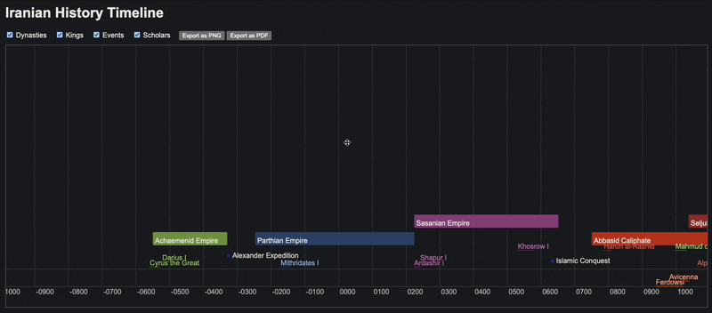

# Iranian History Timeline

The **Iranian History Timeline** is an interactive web application that visualizes Iran’s historical narrative, spanning from the Elamite Kingdom (2700 BC) to the 1979 Islamic Revolution. This tool enables users to explore dynasties, rulers, scholars, and significant events through a dynamic, zoomable timeline, with features for filtering categories and exporting views as PNG or PDF.

Designed for historians, educators, and enthusiasts, the project requires no coding expertise to use or extend. This guide provides clear instructions for setup, usage, and data management.

## Features

- **Interactive Timeline**: Zoom and pan across centuries, from ancient Persia to modern Iran.
- **Category Filters**: Toggle visibility of dynasties, rulers, scholars, and events.
- **Detailed Tooltips**: Hover to view dates, descriptions, and dynasty affiliations for rulers.
- **Export Options**: Save timeline views as PNG or PDF for presentations or sharing.
- **Extensible Data**: Add new entries via CSV files using spreadsheet tools.

## Getting Started

This section outlines how to download and run the timeline locally using a Python server, ensuring reliable data loading in browsers like Chrome, Firefox, Edge, or Safari.

### Prerequisites

- **Python 3.x**:
  - Verify installation:
    python --version
    Or:
    python3 --version
    Expect output like `Python 3.8.10`. If absent, install from python.org/downloads.
- A modern browser with internet access (required for downloading and exports; the timeline operates offline otherwise).
- Basic skills in unzipping files and using a terminal or command prompt.

### Installation

1. **Download the Project**:
   - On the GitHub repository, click the green **Code** button and select **Download ZIP**.
   - Save to a convenient location (e.g., Desktop or Downloads).
2. **Extract the Archive**:
   - **Windows**: Right-click the ZIP → **Extract All** → **Extract**.
   - **Mac/Linux**: Double-click or run `unzip` in a terminal.
   - This creates a folder, typically `iranian-history-timeline-main`.

### Running the Timeline

A local server is required to load CSV data due to browser security restrictions.

1. **Open a Terminal**:
   - **Windows**: Search `cmd` in the Start menu.
   - **Mac**: Search `Terminal` via Spotlight (`Cmd + Space`).
   - **Linux**: Press `Ctrl + Alt + T`.
2. **Navigate to the Project Folder**:
   cd path/to/iranian-history-timeline-main
   Example (if on Desktop):
   cd ~/Desktop/iranian-history-timeline-main
   Tip: Drag the folder into the terminal to auto-fill the path.
3. **Start the Server**:
   python -m http.server 8000
   If unsuccessful, try:
   python3 -m http.server 8000
   Confirm the output: `Serving HTTP on 0.0.0.0 port 8000...`. Keep the terminal open.
4. **Access the Timeline**:
   In your browser, navigate to:
   http://localhost:8000
   The timeline should display with dynasties, rulers, and more.
5. **Alternative (Less Reliable)**:
   Double-click `index.html` in the project folder.
   Note: This may result in a blank timeline due to browser restrictions. Prefer the server method.

To stop the server, press `Ctrl + C` in the terminal.

### Troubleshooting

- **Timeline fails to load**:
  - Ensure the server is active (`Serving HTTP...` in terminal).
  - Verify the URL is `http://localhost:8000` (not `https://`).
  - Check the `data` folder contains `dynasties.csv`, `kings.csv`, `scholars.csv`, `events.csv`.
  - Test in another browser.
- **Command `python: command not found`**:
  - Install Python from python.org/downloads.
  - Use `python3` if `python` fails.
- **Timeline appears blank**:
  - Zoom out using the mouse wheel.
  - Ensure all category checkboxes are selected.
  - Use the server method instead of opening `index.html` directly.
- **Exports fail**:
  - Confirm internet connectivity, required for PNG/PDF generation.
  - Try a different browser or reload the page.
- **Folder navigation issues**:
  - Validate the path; drag the folder into the terminal.
  - Note case sensitivity on Mac/Linux.

For further assistance, search “run Python HTTP server” online or consult a technical contact.

## Using the Timeline

- **Filtering**: Use checkboxes to show/hide Dynasties, Rulers, Scholars, or Events.
- **Navigation**: Drag to pan across time; scroll to zoom from years to centuries.
- **Details**: Hover over items for tooltips with dates, descriptions, and ruler-dynasty connections.
- **Exporting**: Click **Export as PNG** or **Export as PDF** to save views (requires internet).

## Managing Data

The timeline is powered by four CSV files in the `data` folder: `dynasties.csv`, `kings.csv`, `scholars.csv`, and `events.csv`. You can add or edit entries using spreadsheet software like Microsoft Excel, Google Sheets, or LibreOffice Calc.

### Adding New Entries

1. **Open a CSV File**:
   - Locate the relevant file in the `data` folder.
   - Open it in a spreadsheet program or text editor (e.g., Notepad, VS Code).
2. **Add a New Row**:
   - Append a new row at the end of the file, matching the existing format.
   - Ensure all required fields are filled (see below).
3. **Save the File**:
   - Save as a CSV file, preserving the `.csv` extension and UTF-8 encoding.
   - Avoid adding extra commas or quotes that could disrupt parsing.
4. **Reload the Timeline**:
   - Restart the Python server (`Ctrl + C`, then rerun `python -m http.server 8000`).
   - Refresh the browser at `http://localhost:8000` to see updates.

### CSV Fields

Each CSV file shares a common structure. Below are the fields and their purposes, with examples:

- **name** (required): The name of the dynasty, ruler, scholar, or event.
  - Example: `Cyrus the Great` (kings.csv), `Achaemenid Empire` (dynasties.csv).
- **type** (required): The category of the entry.
  - Options: `dynasty`, `king`, `scholar`, `event`.
  - Example: `king` (kings.csv), `event` (events.csv).
- **start_date** (required): The start year, formatted as `YYYY BC` or `YYYY AD`.
  - Example: `559 BC` (Cyrus the Great), `651 AD` (Fall of Sassanids).
- **end_date** (optional): The end year, formatted as `YYYY BC` or `YYYY AD`. Required for dynasties, rulers, and scholars; optional for events (point-in-time).
  - Example: `530 BC` (Cyrus the Great), `375 AD` (Kushan Dynasty).
- **significance** (optional): A number (1–5) indicating importance, affecting display prominence. Default: 1.
  - Example: `5` (Darius I), `3` (Minor Battle).
- **dynasty_name** (optional): Links rulers to a dynasty (from `dynasties.csv`’s `name` field). Required for rulers; leave blank for others.
  - Example: `Achaemenid Empire` (kings.csv), empty for scholars/events.
  - Note: Must exactly match a dynasty’s `name` for correct color and tooltip display.
- **image** (optional): URL or local path to an image (e.g., ruler portrait). Displays in tooltips.
  - Example: `images/cyrus.jpg` (kings.csv).
- **color** (optional): Hex code for display color, primarily for dynasties. Rulers inherit dynasty colors.
  - Example: `#FF0000` (dynasties.csv), empty for kings (uses dynasty_name).
- **description** (optional): A brief summary, shown in tooltips. Default: “No description available.”
  - Example: `Founded the Achaemenid Empire` (Cyrus the Great).

**Tips**:
- For rulers, ensure `dynasty_name` matches a `name` in `dynasties.csv` (case-sensitive).
- Use consistent date formats (e.g., `2700 BC`, `1979 AD`) to avoid parsing errors.
- Test changes by reloading the timeline to catch formatting issues.

## Technical Overview

The project is built with:
- **HTML/JavaScript/CSS**: Core structure and styling.
- **Vis.js Timeline**: Renders the interactive timeline.
- **Papa Parse**: Parses CSV data.
- **html2canvas/jsPDF**: Enables PNG and PDF exports.

No coding is required to use or modify the timeline, but developers can explore these libraries for customization.

## Contributing

To contribute:
- **Data Updates**: Propose new entries or corrections by editing CSVs and submitting via GitHub Issues.
- **Code Enhancements**: Fork the repository, make changes, and submit a pull request.

Please ensure data accuracy and cite sources for historical additions.

## License

This project is licensed for educational and personal use under the MIT License. See `LICENSE` for details. Credit the project when sharing or adapting.

## Acknowledgments

This timeline celebrates Iran’s rich heritage, made accessible through open-source tools and community contributions. Thank you to all who use, extend, or provide feedback on this project.